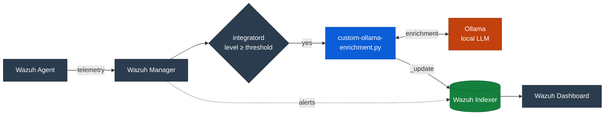
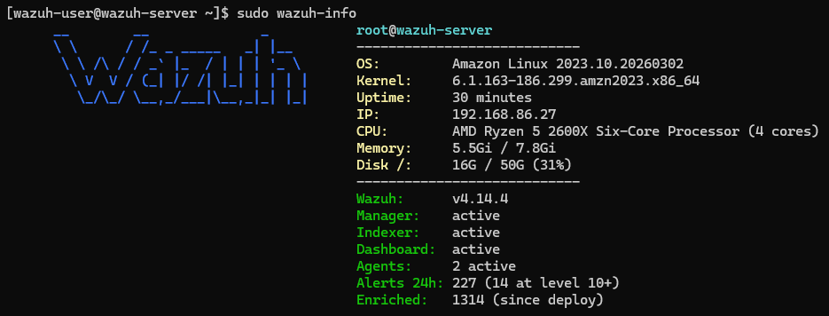
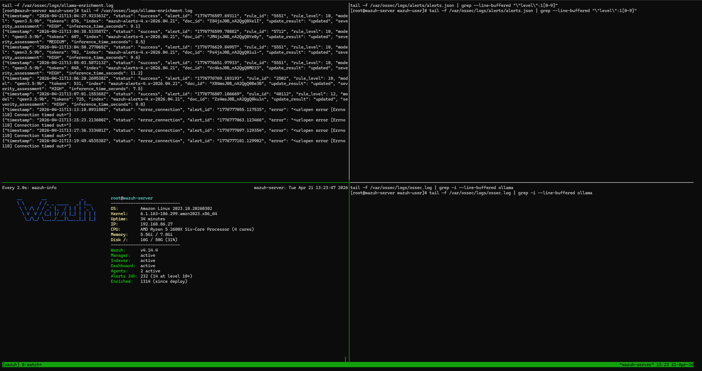

# Wazuh + Ollama LLM Alert Enrichment

Automatically enrich high-severity Wazuh SIEM alerts with contextual analysis using a locally hosted LLM via [Ollama](https://ollama.com/). No alert data leaves your environment.

When a Wazuh rule fires at the configured severity threshold, the integration sends the full alert JSON to a local Ollama instance. The LLM returns a structured enrichment containing a severity assessment, MITRE ATT&CK mapping, investigation steps, recommended actions, and a false positive likelihood rating. The enrichment is written back onto the original alert document in OpenSearch, so it appears alongside the raw alert in the Wazuh dashboard.

## Architecture



## Enrichment Fields

After enrichment, the original alert document contains:

| Field                                          | Description                                    |
| ---------------------------------------------- | ---------------------------------------------- |
| `data.ai_enrichment.severity_assessment`       | CRITICAL / HIGH / MEDIUM / LOW / INFORMATIONAL |
| `data.ai_enrichment.summary`                   | Plain-language description of the alert        |
| `data.ai_enrichment.mitre_attack`              | Tactic, tactic ID, technique, technique ID     |
| `data.ai_enrichment.investigation_steps`       | Specific steps to investigate the alert        |
| `data.ai_enrichment.recommended_actions`       | Specific response actions                      |
| `data.ai_enrichment.confidence`                | HIGH / MEDIUM / LOW                            |
| `data.ai_enrichment.false_positive_likelihood` | HIGH / MEDIUM / LOW                            |
| `data.ai_enrichment.additional_context`        | Further contextual analysis                    |
| `data.ai_enrichment.model_used`                | LLM model name                                 |
| `data.ai_enrichment.inference_time_seconds`    | Response time                                  |
| `data.ai_enrichment.tokens_generated`          | Output token count                             |
| `data.ai_enrichment.tokens_per_second`         | Inference speed                                |
| `data.ai_enrichment.enriched_at`               | ISO timestamp                                  |

## Results

Before and after enrichment of the same alert in the Wazuh dashboard:

| Before enrichment | After enrichment |
| --- | --- |
|  |  |

The enriched alert includes a severity assessment, MITRE ATT&CK mapping, investigation steps, and recommended actions - written directly onto the original alert document in OpenSearch so it appears alongside the raw alert.

## Prerequisites

- Wazuh 4.x with at least one connected agent
- Ollama running on a reachable host with `OLLAMA_HOST=0.0.0.0` (if remote)
- A suitable LLM model pulled in Ollama (recommended: `qwen3.5:9b`)

## Quick Start

```bash
# On the Wazuh server
git clone https://github.com/DrewCam/wazuh-ollama-enrichment.git
cd wazuh-ollama-enrichment
sudo bash deploy-ollama-integration.sh
```

The deploy script will:

1. Copy integration scripts to `/var/ossec/integrations/`
2. Create log files with correct permissions
3. Create a runtime config file at `/var/ossec/etc/ollama-enrichment.conf` for indexer credentials and TLS options
4. Optionally insert the integration block into `ossec.conf`
5. Test connectivity to Ollama and the Wazuh Indexer

After deployment:

```bash
# Set <hook_url> in the integration block to your Ollama host,
# e.g. http://192.168.1.100:11434 or http://localhost:11434
sudo nano /var/ossec/etc/ossec.conf

# (Optional) Enable debug logging before the restart so a single
# restart picks up both changes
echo 'integrator.debug=2' | sudo tee -a /var/ossec/etc/local_internal_options.conf

# Restart the Wazuh manager
sudo systemctl restart wazuh-manager
```

## Manual Deployment

If you prefer not to use the deploy script, run the following steps on the Wazuh server as root (or with `sudo`). The steps replicate what the deploy script does.

Clone the repository first and change into it - the `cp` commands below assume these files are in your current working directory:

```bash
git clone https://github.com/DrewCam/wazuh-ollama-enrichment.git
cd wazuh-ollama-enrichment
sudo -i   # or prefix each command below with sudo
```

**1. Copy the integration scripts to the Wazuh integrations directory**

```bash
cp custom-ollama-enrichment    /var/ossec/integrations/
cp custom-ollama-enrichment.py /var/ossec/integrations/
```

**2. Set ownership and permissions (Wazuh requires `root:wazuh`, mode `750`)**

```bash
chmod 750 /var/ossec/integrations/custom-ollama-enrichment
chmod 750 /var/ossec/integrations/custom-ollama-enrichment.py
chown root:wazuh /var/ossec/integrations/custom-ollama-enrichment
chown root:wazuh /var/ossec/integrations/custom-ollama-enrichment.py
```

**3. Create the audit and debug log files**

```bash
touch /var/ossec/logs/ollama-enrichment.log
touch /var/ossec/logs/ollama-enrichment-debug.log
chown wazuh:wazuh /var/ossec/logs/ollama-enrichment.log
chown wazuh:wazuh /var/ossec/logs/ollama-enrichment-debug.log
chmod 660 /var/ossec/logs/ollama-enrichment.log
chmod 660 /var/ossec/logs/ollama-enrichment-debug.log
```

**4. Create the runtime config file (indexer credentials + TLS)**

```bash
cat > /var/ossec/etc/ollama-enrichment.conf <<EOF
indexer_url=https://127.0.0.1:9200
indexer_user=admin
indexer_pass=admin
indexer_verify_tls=false
EOF
chown root:wazuh /var/ossec/etc/ollama-enrichment.conf
chmod 640 /var/ossec/etc/ollama-enrichment.conf
```

This file carries the script's runtime settings that should not live in `ossec.conf` (indexer credentials and TLS verification). Wazuh integration wiring - Ollama URL, model, alert threshold - lives in the `<integration>` block in `ossec.conf` (step 5 below).

Update the credentials to match your indexer. `indexer_verify_tls=false` is needed for the Wazuh OVA's self-signed certificate; set it to `true` in production with a CA-signed indexer certificate (optionally add `indexer_ca_path=/path/to/ca.pem` for an internal CA). If this file is absent, the script cannot authenticate with the indexer.

**5. Add the integration block to `/var/ossec/etc/ossec.conf`**

Edit the file and paste the block immediately before the closing `</ossec_config>` tag:

```xml
<integration>
  <name>custom-ollama-enrichment</name>
  <hook_url>http://OLLAMA_HOST_IP:11434</hook_url>
  <api_key>model:qwen3.5:9b</api_key>
  <level>10</level>
  <alert_format>json</alert_format>
</integration>
```

Replace `OLLAMA_HOST_IP` with your Ollama host address (or `localhost` for a single-host deployment). The `<api_key>` field carries the LLM model name in the form `model:<name>` - change it to use a different model, e.g. `<api_key>model:gemma4:e4b</api_key>`. If the `<api_key>` line is omitted the script defaults to `qwen3.5:9b`. The block is also provided as `ossec-integration-block.xml` in the repo for easy copy-paste.

**6. (Optional) Enable debug logging**

```bash
echo "integrator.debug=2" >> /var/ossec/etc/local_internal_options.conf
```

**7. Restart the Wazuh manager**

```bash
systemctl restart wazuh-manager
```

**8. (Optional) Verify connectivity**

Confirm Ollama and the Wazuh Indexer are both reachable from the Wazuh server:

```bash
# Ollama - replace OLLAMA_HOST_IP as above (or localhost)
curl -s --connect-timeout 5 http://OLLAMA_HOST_IP:11434/api/tags | head -c 200

# Wazuh Indexer - use the credentials from ollama-enrichment.conf
curl -sk -u admin:admin https://127.0.0.1:9200/_cluster/health
```

Ollama should return a JSON list of installed models. The Indexer should return cluster health JSON with `"status":"green"` (or yellow on a fresh single-node install). If either fails, the enrichment script will log a connection error the first time an alert fires. Check `OLLAMA_HOST=0.0.0.0` on the Ollama host and firewall rules on TCP/11434, and verify `wazuh-indexer.service` is running.

## Configuration

### Ollama host and model (`ossec.conf`)

The integration block in `/var/ossec/etc/ossec.conf` controls the Ollama host, model, and alert threshold:

```xml
<integration>
  <name>custom-ollama-enrichment</name>
  <hook_url>http://OLLAMA_HOST_IP:11434</hook_url>
  <api_key>model:qwen3.5:9b</api_key>
  <level>10</level>
  <alert_format>json</alert_format>
</integration>
```

| Parameter  | Description                                                              |
| ---------- | ------------------------------------------------------------------------ |
| `hook_url` | Ollama address. Use `http://localhost:11434` if on the same machine.     |
| `api_key`  | LLM model selector in `model:<name>` format. Default: `qwen3.5:9b`.      |
| `level`    | Minimum alert severity to enrich. 10 is recommended as a starting point. |

### Runtime config (`ollama-enrichment.conf`)

Indexer credentials and TLS verification options live in `/var/ossec/etc/ollama-enrichment.conf`. This file is separate from `ossec.conf` so that indexer credentials don't end up in the same file that operators typically share for Wazuh troubleshooting. Wazuh integration wiring (Ollama URL, model, alert threshold) lives in the `<integration>` block in `ossec.conf`.

The deploy script creates this file automatically. To configure it manually, copy the included example:

```bash
sudo cp ollama-enrichment.conf.example /var/ossec/etc/ollama-enrichment.conf
sudo chown root:wazuh /var/ossec/etc/ollama-enrichment.conf
sudo chmod 640 /var/ossec/etc/ollama-enrichment.conf
sudo nano /var/ossec/etc/ollama-enrichment.conf
```

Supported keys:

| Key                  | Required | Default                     | Description |
| -------------------- | -------- | --------------------------- | ----------- |
| `indexer_url`        | yes      | `https://127.0.0.1:9200`    | Wazuh Indexer URL |
| `indexer_user`       | yes      | -                           | Indexer username |
| `indexer_pass`       | yes      | -                           | Indexer password |
| `indexer_verify_tls` | no       | `true` (secure by default)  | `true` to verify the indexer certificate, `false` to accept self-signed (required for the Wazuh OVA). |
| `indexer_ca_path`    | no       | (system CA store)           | Optional PEM bundle for `indexer_verify_tls=true` with an internal CA. |

The default Wazuh OVA ships with `admin:admin` as the indexer credentials and self-signed certificates. If you are deploying against the OVA, `indexer_verify_tls=false` is required. If you have changed credentials, are using a custom Wazuh deployment, or are running against a CA-signed indexer, update the values accordingly.

You can verify your indexer credentials with:

```bash
curl -sk -u <user>:<pass> https://127.0.0.1:9200/_cluster/health
```

### Endpoint and thinking mode

The script uses Ollama's `/api/generate` endpoint with `think=false`. In practice, this yields faster responses than `/api/chat` for thinking-capable models (e.g. Qwen, Gemma), with output quality remaining broadly comparable.

## Post-Deployment Verification

After the deploy script finishes, verify the integration block in `ossec.conf` has the correct `hook_url` for your Ollama host:

```bash
grep -A5 "custom-ollama" /var/ossec/etc/ossec.conf
```

If the `hook_url` still shows the placeholder (`OLLAMA_HOST_IP`), update it:

```bash
sudo nano /var/ossec/etc/ossec.conf
# Change <hook_url>http://OLLAMA_HOST_IP:11434</hook_url>
# to your Ollama host, e.g. <hook_url>http://192.168.1.100:11434</hook_url>
# or <hook_url>http://localhost:11434</hook_url> if Ollama is on the same machine
```

Restart the manager to apply changes:

```bash
sudo systemctl restart wazuh-manager
```

## Testing

### Standalone test (no Wazuh required)

Verify Ollama connectivity and enrichment quality from any machine that can reach Ollama:

```bash
python3 test-enrichment.py http://localhost:11434 qwen3.5:9b
```

The test script runs four sample alerts (SSH brute force, Windows account creation, FIM `/etc/passwd` modification, and Sysmon process injection) through the same prompt and schema as the production script.

### Trigger a test alert in Wazuh

Generate failed SSH logins from any agent to produce a level 10+ alert:

```bash
# Run on a Wazuh agent (e.g. a Linux endpoint)
for i in $(seq 1 10); do sshpass -p 'wrongpass' ssh -o StrictHostKeyChecking=no -o ConnectTimeout=3 fakeuser@<WAZUH_SERVER_IP> 2>/dev/null; done
```

Or simply attempt manual SSH logins with a wrong password repeatedly:

```bash
ssh nonexistent@<WAZUH_SERVER_IP>    # type wrong password multiple times
```

### Verify enrichment

Watch the audit log on the Wazuh server for enrichment results in real time:

```bash
tail -f /var/ossec/logs/ollama-enrichment.log
```

If debug logging is enabled, check for detailed processing information:

```bash
tail -f /var/ossec/logs/ollama-enrichment-debug.log
```

### Query enriched alerts from OpenSearch

To retrieve the full enrichment for a specific alert document:

```bash
# Find recent enriched alerts (replace credentials with your own)
curl -sk -u admin:admin "https://localhost:9200/wazuh-alerts-*/_search" \
  -H 'Content-Type: application/json' \
  -d '{"query":{"exists":{"field":"data.ai_enrichment"}},"size":1,"sort":[{"timestamp":{"order":"desc"}}]}' \
  | python3 -m json.tool
```

To view just the enrichment fields for a specific document ID:

```bash
curl -sk -u admin:admin \
  "https://localhost:9200/wazuh-alerts-*/_doc/<DOC_ID>?filter_path=_source.rule,_source.data.ai_enrichment" \
  | python3 -m json.tool
```

In the Wazuh dashboard, open any alert and look for `data.ai_enrichment` fields containing the LLM analysis.

## Sysmon Integration (Optional)

Installing [Sysmon](https://learn.microsoft.com/en-us/sysinternals/downloads/sysmon) on Windows agents provides detailed endpoint telemetry (process creation, network connections, driver loading, etc.) that Wazuh decodes and matches automatically using built-in rules (rule IDs 61600+, 92000+). No server-side rule changes are needed; Sysmon alerts at or above the enrichment threshold are enriched by the Ollama pipeline the same way as native Wazuh alerts.

For the full deployment walkthrough - including the recommended centralised agent-group configuration used in this project - see [`docs/sysmon.md`](docs/sysmon.md).

## Monitoring Helpers

Two optional scripts for the Wazuh server:

- **`wazuh-info`** - Neofetch-style status snapshot showing system info, Wazuh service health, agent count, 24h alert counts, and enrichment totals. Install to `/usr/local/bin/`. Run with `sudo` - it reads root-owned Wazuh configuration and the indexer credentials file.

  

- **`wazuh-watch`** - Launches a four-pane tmux dashboard for live monitoring of the enrichment log, high-severity alerts, integratord output, and refreshing `wazuh-info`. Install to `/usr/local/bin/`.

  

```bash
sudo cp wazuh-info wazuh-watch /usr/local/bin/
sudo chmod +x /usr/local/bin/wazuh-info /usr/local/bin/wazuh-watch
```

## Files

| File                           | Purpose                                                                |
| ------------------------------ | ---------------------------------------------------------------------- |
| `custom-ollama-enrichment`     | Shell wrapper - invokes the Python script using Wazuh's bundled Python |
| `custom-ollama-enrichment.py`  | Main integration script                                                |
| `deploy-ollama-integration.sh` | Automated deployment with manual steps documented in the header        |
| `ossec-integration-block.xml`  | Integration block to add to `ossec.conf`                               |
| `test-enrichment.py`           | Standalone test script with sample alerts                              |
| `wazuh-info`                   | Neofetch-style Wazuh status snapshot                                   |
| `wazuh-watch`                  | Four-pane tmux monitoring dashboard                                    |
| `ollama-enrichment.conf.example` | Template config file for indexer credentials and TLS settings        |

## Troubleshooting

| Issue | Cause | Fix |
|-------|-------|-----|
| No enrichments appearing | Integration not triggering | Check `grep integrat /var/ossec/logs/ossec.log` for errors. Verify the integration block is uncommented in `ossec.conf` and the manager has been restarted. |
| Connection refused (Ollama) | Ollama not listening on the network | If Ollama is on a separate host, ensure it's started with `OLLAMA_HOST=0.0.0.0` (the default localhost-only binding won't accept remote connections) and that the firewall allows TCP/11434 from the Wazuh server. On a single-host deployment the default is fine. Test reachability with `curl http://<ollama_host>:11434/api/version`. |
| Connection refused (Indexer) | Indexer service down or credentials wrong | Run `systemctl status wazuh-indexer` to check the service. Verify credentials in `ollama-enrichment.conf` match your indexer. Test with `curl -sk -u user:pass https://127.0.0.1:9200/_cluster/health`. |
| Permission denied | Script permissions incorrect | Run `ls -la /var/ossec/integrations/custom-ollama*` and verify ownership is `root:wazuh` with mode `750`. Re-run the deploy script or fix manually with `chown` and `chmod`. |
| HTTP 400 on indexer write | Conflicting field mappings from a previous schema mismatch | OpenSearch index mappings are permanent per day. Wait for a new day's index to roll over, or remove the conflicting `data.ai_enrichment` fields with an `_update_by_query`. |
| JSON parse errors | Model returning malformed output | Enable debug logging and check `/var/ossec/logs/ollama-enrichment-debug.log`. Test the model independently with `test-enrichment.py`. Consider switching to a model with better structured output support. |
| Slow responses | Model too large for available VRAM | Check GPU utilisation. Try a smaller model (e.g. `gemma4:e4b` at 3.3 GB) or ensure the model fits fully in VRAM to avoid CPU offloading. |

## Acknowledgements

This project integrates with two upstream open-source projects:

- [Wazuh](https://wazuh.com/) - open-source SIEM/XDR platform
- [Ollama](https://ollama.com/) - local LLM runtime

The optional Sysmon integration uses [sysmon-modular](https://github.com/olafhartong/sysmon-modular) by Olaf Hartong, referenced via Wazuh's [Emulation of ATT&CK techniques and detection with Wazuh](https://wazuh.com/blog/emulation-of-attck-techniques-and-detection-with-wazuh/) blog post.

Wazuh's own [LLM alert enrichment proof-of-concept guide](https://documentation.wazuh.com/current/proof-of-concept-guide/leveraging-llms-for-alert-enrichment.html) informed the initial design; this project differs by using fully local inference via Ollama (no alert data leaves the environment), writing enrichment onto the original alert document, and enforcing structured JSON output via Ollama's `format` parameter.
