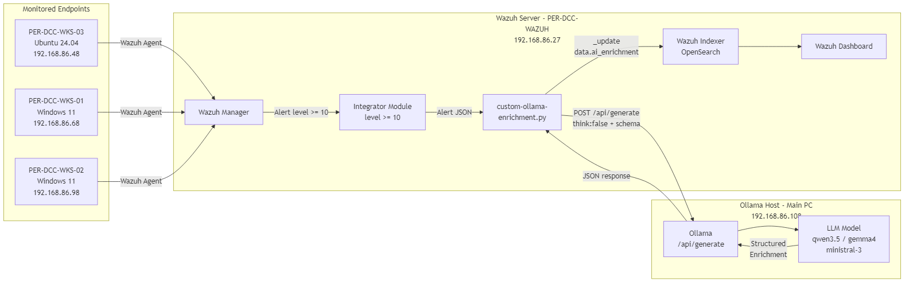
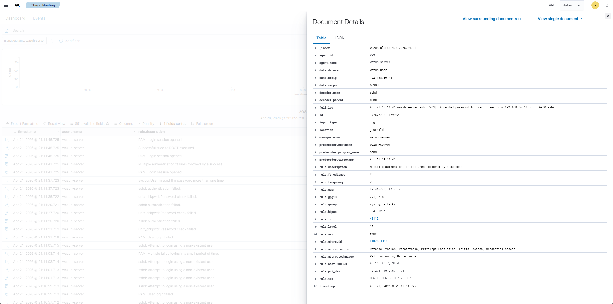
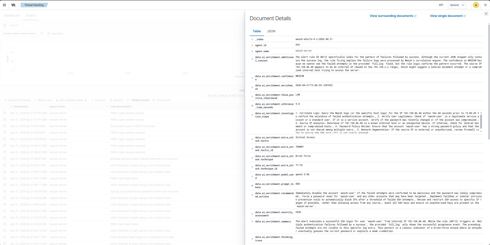
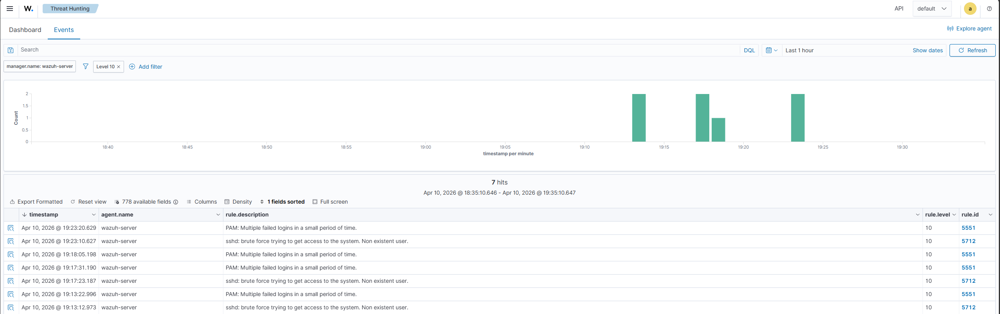

# Technical Report: Wazuh SIEM with Local AI-Powered Alert Enrichment

**CYB6016 Cyber Security Investigation - Final Deliverable**
**Author:** Drew Cameron (10215233)
**Date:** 28 April 2026
**Repository:** <https://github.com/DrewCam/wazuh-ollama-enrichment>

---

## Executive Summary

Modern security operations centres (SOCs) face a structural mismatch: alert volumes scale with telemetry, but analyst time does not. Routine triage - confirming severity, mapping to MITRE ATT&CK, and recommending next steps - consumes a disproportionate share of that time. This project addresses the mismatch by embedding an LLM directly into the Wazuh alert pipeline, adding contextual analysis at the point of alert generation rather than leaving it for human analysts.

The deliverable is a production-style integration between Wazuh 4.14.4 (an open-source SIEM) and Ollama (a local LLM runtime). When a Wazuh rule fires at or above a configured severity threshold, the integration forwards the full alert JSON to a locally hosted model. The model returns a structured JSON response containing a severity assessment, MITRE ATT&CK mapping, investigation steps, recommended actions, and a false positive likelihood. This enrichment is written directly onto the original alert document in OpenSearch, so analysts see it alongside the raw alert in the Wazuh dashboard.

All inference happens on-premises - no alert data leaves the environment. This addresses a practical blocker to LLM adoption in security teams: the reluctance to send raw alert data, which often contains hostnames, usernames, file paths, and command lines, to a cloud provider.

Across eleven successful live enrichment runs covering eight distinct alert categories (SSH brute force, PAM authentication failures, Windows account creation, file integrity monitoring, Sysmon process access, encoded PowerShell, dropped executables, and Application Compatibility Database launches), the production configuration - qwen3.5:9b on Ollama's `/api/generate` endpoint with thinking mode disabled - achieved 100% JSON validity, correct MITRE mapping on all but one case (where the LLM's alternative mapping was arguably more accurate than Wazuh's built-in rule), and inference times between 7.9 and 15.7 seconds per alert. The integration correctly distinguished between true positives (e.g. `testattacker` account creation: HIGH severity, LOW FP likelihood) and benign noise (e.g. OneDrive accessing Explorer: MEDIUM severity, HIGH FP likelihood).

The repository is deployable end-to-end from a fresh clone via a single command, with the integration script, deploy script, test harness, monitoring helpers, and documentation all in one place.

---

## 1. Problem Statement

### 1.1 Alert fatigue in modern SOCs

The Australian Signals Directorate's *Annual Cyber Threat Report 2024-25* (Australian Signals Directorate [ASD], 2025) records a continued rise in both the volume and sophistication of cyber incidents targeting Australian organisations. The scale of telemetry a typical SOC must process has grown with it. Joint guidance from the Cybersecurity and Infrastructure Security Agency and ASD's Australian Cyber Security Centre - *Implementing SIEM and SOAR Platforms: Practitioner Guidance* (Cybersecurity and Infrastructure Security Agency [CISA] & ASD, 2025) - explicitly identifies alert overload as a systemic risk: high-severity indicators are routinely missed not because detection failed, but because the triage queue is too long.

Habibzadeh et al. (2025), in a comprehensive survey of LLM applications in SOCs, note that routine Tier-1 triage work - alert categorisation, severity validation, MITRE mapping, and initial investigation guidance - is both repetitive and reasonably well-bounded. It is exactly the kind of task where LLM-assisted enrichment can add value without displacing the analyst's judgement on the harder questions of scope, containment, and attribution.

### 1.2 Why local inference

Srinivas et al. (2025) argue that structured output is critical for SOC LLM applications: unstructured free-text responses are unreliable as input to downstream automation and force analysts to re-parse the analysis manually. Enforced JSON schemas, via constrained decoding or API-level format parameters, are now a practical requirement.

A second requirement is data residency. Commercial LLM providers offer strong models but require the full alert context to be sent off-premises. For many organisations - particularly those subject to the Western Australian Government's *2024 WA Government Cyber Security Policy* (Office of Digital Government [ODG], 2024) or industry-specific regulations - that is a non-starter. Alert data frequently contains hostnames, usernames, file paths, command lines, and network addresses that are themselves sensitive.

Ollama's local inference model resolves this directly. The integration described here keeps every byte of alert data inside the customer environment. The trade-off is that inference must run on hardware the customer owns and sizes for the model they choose.

### 1.3 Why Wazuh's native Integrator module

Wazuh publishes a proof-of-concept for LLM alert enrichment (Wazuh, n.d.-b) that uses Active Response to call the OpenAI cloud API, sends only a YARA rule description (not the full alert), writes the response to a log file, and re-parses that log into a new alert. This project diverges from the official PoC in four ways:

1. **Integrator module instead of Active Response.** The Integrator module (Wazuh, n.d.-a) is the purpose-built extension point for third-party systems. Active Response is designed for remediation actions on endpoints.
2. **Full alert JSON is sent.** The LLM has the complete alert context - source IP, rule groups, decoder fields, MITRE annotations from Wazuh's own ruleset - not just a rule description.
3. **Enrichment is written onto the original alert.** The enrichment appears as `data.ai_enrichment.*` fields on the same OpenSearch document as the raw alert. No new alerts are created. The dashboard shows raw and enriched data in the same view.
4. **Structured output is enforced via Ollama's `format` parameter.** The response must conform to a predefined JSON schema. Non-conforming responses are normalised best-effort (missing fields filled with conservative defaults) rather than being appended as free text.

---

## 2. Solution Architecture



*Figure 1. End-to-end pipeline: Wazuh agents forward telemetry to the manager; alerts at or above the configured severity threshold (default level 10) invoke the Integrator module, which hands the alert JSON to `custom-ollama-enrichment.py`. The script calls Ollama's `/api/generate` endpoint on a locally hosted model, normalises the structured response, and writes the enrichment back onto the original alert document in the Wazuh Indexer (OpenSearch) via `_update`.*

### 2.1 Pipeline

1. A Wazuh agent installed on the monitored endpoint collects events from the operating system and applications - syslog, Windows Event Log, Sysmon channels, file integrity changes - and forwards them over an encrypted channel to the Wazuh manager. The agent also generates its own telemetry via built-in modules (file integrity monitoring, security configuration assessment, rootcheck).
2. The Wazuh manager processes each event through its decoders and rules. If an alert is raised at or above the configured severity threshold, the integratord daemon invokes `custom-ollama-enrichment.py` with the alert JSON.
3. The enrichment script sends the alert to Ollama's `/api/generate` endpoint along with a system prompt, a user prompt built from the alert context, and a `format` parameter constraining the response to a defined JSON schema. `think: false` is set explicitly to suppress reasoning output.
4. Ollama returns the structured JSON directly in the `response` field of its API payload.
5. The script looks up the alert document in OpenSearch by ID, then issues an `_update` call to add `data.ai_enrichment.*` fields onto the original document.
6. The enriched alert is visible in the Wazuh dashboard alongside the raw alert data.

### 2.2 Enrichment schema

The schema enforced by the `format` parameter defines the following fields:

| Field | Description |
|-------|-------------|
| `severity_assessment` | CRITICAL / HIGH / MEDIUM / LOW / INFORMATIONAL |
| `summary` | Plain-language description |
| `mitre_attack` | Tactic, tactic ID, technique, technique ID |
| `investigation_steps` | Specific steps referencing the alert context |
| `recommended_actions` | Specific response actions |
| `confidence` | HIGH / MEDIUM / LOW |
| `false_positive_likelihood` | HIGH / MEDIUM / LOW |
| `additional_context` | Further analysis |
| `model_used`, `inference_time_seconds`, `tokens_generated`, `tokens_per_second`, `enriched_at` | Operational metadata |

### 2.3 Key design decisions

**`/api/generate` with `think: false`.** Initial implementation used Ollama's `/api/chat` endpoint with thinking-capable models (Qwen, Gemma). Wireshark packet captures on the Ollama loopback interface revealed two distinct failures on `/api/chat`: models placed valid structured JSON in the `thinking` field rather than `content` (requiring a fallback parser), and thinking-phase reasoning loops on specific alert types (Windows Event 4720 with `userAccountControl` hex format strings) consumed all 4096 tokens before any JSON was generated. Switching to `/api/generate` with `think: false` suppresses the reasoning phase entirely, returns the structured JSON directly in `response`, and delivers a 3.6x-4.7x speedup on identical alerts.

**Writing to the original document, not a new one.** OpenSearch's `_update` API allows partial document modification. This preserves the single source of truth for each alert and avoids the "duplicate alert" pattern of the Wazuh PoC, which creates downstream filtering problems.

**Two-file configuration with a deliberate boundary.** Wazuh's `<integration>` XML schema only accepts a fixed set of child elements, so the configuration is split across two files along a semantic boundary:

- **`ossec.conf` integration block** carries Wazuh integration wiring: the Ollama URL (`<hook_url>`), the LLM model (`<api_key>model:<name></api_key>`), the alert threshold (`<level>`), and the alert format.
- **`ollama-enrichment.conf`** (mode 640, owner `root:wazuh`) carries script runtime settings that should not live in `ossec.conf` - indexer credentials and TLS verification options. Isolating credentials this way means operators can share `ossec.conf` for Wazuh troubleshooting without also sharing indexer passwords.

Model switches are a one-line edit in `ossec.conf`; TLS changes are a one-line edit in `ollama-enrichment.conf`; no code changes required for either.

**TLS verification secure by default.** The script defaults to verifying the indexer certificate. The Wazuh OVA ships with self-signed indexer certificates, so the deploy script writes `indexer_verify_tls=false` into the generated `.conf` file for out-of-the-box OVA compatibility. Production deployments against CA-signed indexer certificates leave the flag as `true`, and an optional `indexer_ca_path` lets operators trust internal CAs without disabling verification.

---

## 3. Implementation

### 3.1 Lab environment

| Component | Host | OS | IP | Role |
|-----------|------|----|----|----|
| Wazuh Server | PER-DCC-WAZUH | Wazuh 4.14.4 OVA (Amazon Linux 2023) | 192.168.86.27 | Manager, indexer, dashboard |
| Agent 001 | PER-DCC-WKS-03 | Ubuntu Desktop 24.04 | 192.168.86.48 | Linux monitored endpoint |
| Agent 002 | PER-DCC-WKS-01 | Windows 11 Pro | 192.168.86.68 | Windows monitored endpoint (+ Sysmon) |
| Agent 003 | PER-DCC-WKS-02 | Windows 11 Pro | 192.168.86.98 | Windows monitored endpoint (+ Sysmon) |
| Ollama Host | Main PC | Windows 11 | 192.168.86.108 | LLM inference (RTX 4080 16GB VRAM) |

Ollama is run with `OLLAMA_HOST=0.0.0.0` so the Wazuh server can reach it over the lab network on TCP/11434. In a single-host deployment the Ollama host and Wazuh server can be co-located; the code path is identical.

### 3.2 Integration components

All components live in the deployable repository:

| File | Purpose |
|------|---------|
| `custom-ollama-enrichment` | Shell wrapper - invokes the Python script under Wazuh's bundled Python |
| `custom-ollama-enrichment.py` | Main integration script (Python stdlib only) |
| `deploy-ollama-integration.sh` | End-to-end deployment with safety checks |
| `ossec-integration-block.xml` | The `<integration>` block to add to `ossec.conf` |
| `ollama-enrichment.conf.example` | Template for indexer credentials and TLS settings |
| `test-enrichment.py` | Standalone harness with four representative alert samples |
| `wazuh-info` | Neofetch-style Wazuh status snapshot |
| `wazuh-watch` | Four-pane tmux dashboard for live monitoring |

The script uses only Python stdlib (`urllib`, `json`, `ssl`, `base64`) because Wazuh's bundled Python does not have `pip`. This constraint is a feature, not a limitation: the deployment has no external package management story to get wrong.

### 3.3 Integration configuration

Configuration is split across two files along a semantic boundary: Wazuh integration wiring in `ossec.conf`, script runtime (credentials and TLS) in `ollama-enrichment.conf`.

The `<integration>` block in `/var/ossec/etc/ossec.conf`:

```xml
<integration>
  <name>custom-ollama-enrichment</name>
  <hook_url>http://192.168.86.108:11434</hook_url>
  <api_key>model:qwen3.5:9b</api_key>
  <level>10</level>
  <alert_format>json</alert_format>
</integration>
```

- `hook_url` - Ollama host. `http://localhost:11434` on a single-host deployment.
- `api_key` - LLM model selector in `model:<name>` format. Example alternatives: `model:gemma4:e4b`, `model:ministral-3:14b`. Omitting the field (or the `model:` prefix) defaults the script to `qwen3.5:9b`.
- `level` - minimum alert severity to enrich. The production configuration uses level 10 to focus on high-severity events and avoid queue saturation (see §6.4). During FIM validation (test T8) the threshold was temporarily lowered to 7 to capture rule 550 (`/etc/passwd` modification, level 7), then restored to 10 afterwards.

The runtime config in `/var/ossec/etc/ollama-enrichment.conf` (mode 640, owner `root:wazuh`):

```conf
indexer_url=https://127.0.0.1:9200
indexer_user=admin
indexer_pass=admin
indexer_verify_tls=false          # true in production, false for Wazuh OVA self-signed
#indexer_ca_path=/path/to/ca.pem  # optional, for internal CAs
```

The `indexer_verify_tls` flag defaults to `true` in the script (secure by default) but the deploy script writes `false` for OVA compatibility. End-to-end testing confirmed this: setting `indexer_verify_tls=true` against the OVA's self-signed indexer certificate produces `SSL: CERTIFICATE_VERIFY_FAILED` and the enrichment write is correctly refused, exercising the same code path a production deployment would use.

### 3.4 Deployment flow

From a fresh clone of the repository on the Wazuh server:

```bash
git clone https://github.com/DrewCam/wazuh-ollama-enrichment.git
cd wazuh-ollama-enrichment
sudo bash deploy-ollama-integration.sh
```

The deploy script copies integration files into `/var/ossec/integrations/` with mode 750 and owner `root:wazuh`, creates the log files, generates the credentials config, optionally inserts the integration block into `ossec.conf`, and tests connectivity to Ollama and the Wazuh Indexer. After the script completes, the operator edits the integration block to point at their Ollama host and restarts the manager.

### 3.5 Sysmon deployment on Windows agents

Windows endpoints run Sysmon (Sysinternals, 64-bit) for detailed process, file, and network telemetry. The configuration is Olaf Hartong's sysmon-modular (balanced/medium verbosity, v4.90), sourced from the Wazuh blog post *Emulation of ATT&CK techniques and detection with Wazuh* (Olatunde, 2022), which ships with MITRE ATT&CK technique annotations in the rule names and covers process creation, file creation, network connections, driver loading, and image loading.

Sysmon itself is a local Windows service, so the binary and its XML config are installed per host:

```powershell
# Admin PowerShell on PER-DCC-WKS-01 and PER-DCC-WKS-02
Invoke-WebRequest -Uri https://download.sysinternals.com/files/Sysmon.zip -OutFile $env:TEMP\Sysmon.zip
Expand-Archive -Path $env:TEMP\Sysmon.zip -DestinationPath $env:TEMP\Sysmon -Force
Invoke-WebRequest -Uri "https://wazuh.com/resources/blog/emulation-of-attack-techniques-and-detection-with-wazuh/sysmonconfig.xml" -OutFile "$env:TEMP\Sysmon\sysmonconfig.xml"
& "$env:TEMP\Sysmon\Sysmon64.exe" -accepteula -i "$env:TEMP\Sysmon\sysmonconfig.xml"
```

The Wazuh agent then needs to be told to collect the Sysmon event channel. Rather than editing `C:\Program Files (x86)\ossec-agent\ossec.conf` on every Windows host, this is pushed from the Wazuh manager using **centralised agent configuration**. Both Windows agents are assigned to the `os_windows` group (alongside `default`, and separate from the Ubuntu agent's `os_ubuntu` group, confirmed via `sudo /var/ossec/bin/agent_groups -l`). The group's `agent.conf` on the manager pushes the Sysmon `localfile` directive to every member of the group:

```xml
<!-- /var/ossec/etc/shared/os_windows/agent.conf on the Wazuh manager -->
<agent_config>
  <localfile>
    <location>Microsoft-Windows-Sysmon/Operational</location>
    <log_format>eventchannel</log_format>
  </localfile>
</agent_config>
```

This scales cleanly - adding a new Windows endpoint only requires group assignment at enrolment, not per-host config edits - and keeps Sysmon collection consistent across the Windows fleet. Wazuh 4.14.x ships with Sysmon decoders and rules built in (rule IDs 61600+ and 92000+), so no server-side ruleset changes were needed. Sysmon alerts flowed into the enrichment pipeline on the same level thresholds as native Wazuh alerts, which is how the T5-T7 test cases were exercised.

---

## 4. Testing and Validation

### 4.1 Test plan and coverage

Testing covered five attack categories across two operating systems, graduated from simple (brute force) to complex (Sysmon process access) and from clearly malicious (account creation with a suspicious name) to benign but noisy (PowerShell automation library loading):

| ID | Category | Technique | Agent | Level | Outcome |
|----|----------|-----------|-------|-------|---------|
| T1 | SSH brute force (baseline on `/api/chat`) | T1110 | Linux | 10 | Enriched (44.6s / 39.8s) |
| T2 | Model switch to gemma4:26b | T1110 | Linux | 10 | Schema mismatch → HTTP 400, drove §6.3 finding |
| T3 | SSH brute force (production on `/api/generate` + `think: false`) | T1110 | Linux | 10 | Enriched (12.4s / 8.5s), 3.6×-4.7× speedup vs T1 |
| T5 | Sysmon process access (OneDrive → Explorer) | T1036 | Windows | 12 | Enriched, false positive correctly flagged |
| T6 | Sysmon encoded PowerShell | T1059.001, T1105 | Windows | 12, 15 | 3 alerts enriched, all false positives flagged |
| T7 | Windows account creation (`testattacker`) | T1098 | Windows | 8 | Enriched, true positive, HIGH severity |
| T8 | FIM `/etc/passwd` modification | T1565.001 | Linux | 7 | Enriched, true positive, CRITICAL severity |

T2 is included because its failure mode - gemma4:26b ignoring Ollama's JSON schema constraint and writing non-standard fields to OpenSearch - surfaced the index-mapping-conflict behaviour that became Key Finding 6.3. It is documented as a negative result rather than omitted.

### 4.2 Before/after comparison

Before deployment, the raw SSH brute force alert in the Wazuh dashboard shows only decoder output: timestamp, rule ID, source IP, and the decoded `sshd` log lines. No contextual analysis, no MITRE mapping beyond the one baked into Wazuh's rule, no investigation guidance.

After deployment, the same alert carries a `data.ai_enrichment` block with:

- severity assessment and confidence
- MITRE tactic and technique IDs
- five specific investigation steps referencing the alert's source IP
- five recommended response actions
- a false positive likelihood and rationale

**Before enrichment:**



**After enrichment:**



*Figure 2. The same SSH brute force alert in the Wazuh dashboard before (top) and after (bottom) the enrichment pipeline was deployed. The post-deployment alert carries the `data.ai_enrichment` sub-tree directly on the original alert document - no new alerts created.*

At SOC-dashboard scale, the enrichment appears inline alongside unenriched lower-severity alerts:



*Figure 3. Threat Hunting dashboard filtered to level 10+ alerts. Each row carries the full enrichment payload accessible on expand, without disrupting the existing analyst workflow.*

### 4.3 Summary of enrichment results

Across the live tests, the production configuration achieved:

- **JSON validity:** 11/11 successful enrichments in the final production configuration (`/api/generate` + `think: false` + qwen3.5:9b).
- **MITRE accuracy:** 10/11 matched or meaningfully agreed with Wazuh's built-in mapping. The one divergence (T5) was the LLM remapping a Wazuh "process injection" alert to "masquerading" after analysing the call trace and concluding the access was legitimate OneDrive OS integration - arguably a better mapping than Wazuh's.
- **False positive detection:** The model correctly flagged Sysmon's OneDrive-accessing-Explorer access (T5), the PowerShell automation DLL load (T6), and `sdbinst.exe` (T7) as likely false positives, with HIGH FP likelihood and LOW/MEDIUM severity. It simultaneously assessed the `testattacker` account creation (T7) as HIGH severity, LOW FP likelihood, HIGH confidence - the correct true positive assessment.
- **Inference performance:** 7.9s-15.7s per alert. Median around 10s.

### 4.4 Representative enrichment findings

**T3 - SSH brute force (true positive).** The enrichment correctly identified the source IP as private (192.168.86.48 is in 192.168.0.0/16) and flagged the possibility of a compromised internal host as the attacker. Investigation steps included checking for successful authentications immediately following the failures. Recommended actions included disabling password authentication and enforcing key-based auth. The model also flagged an empty `logname=` field in the PAM log as a forensic gap - context the raw alert did not surface.

**T5 - Sysmon process access (false positive).** The LLM analysed the call trace and determined the access originated from legitimate OneDrive DLLs (`FileSyncClient.dll`, `FileSyncHost.DLL`), not external injection. It assessed FP likelihood as HIGH and recommended verifying file hashes against Microsoft baselines and suppressing rule 92910 for the specific OneDrive signature if confirmed benign.

**T7 - Windows account creation (true positive).** The LLM identified the action as "a classic indicator of an attacker establishing persistence after gaining initial access" and noted that the name `testattacker` is "highly suspicious and suggests an attacker testing or restoring access." Investigation steps referenced Windows Event IDs 4672, 4720, and 4624 for correlation. Recommended actions included immediately disabling the account and auditing other systems for lateral movement.

**T8 - FIM `/etc/passwd` modification (true positive).** The LLM assessed CRITICAL severity with LOW FP likelihood - the strongest response of any tested alert. It noted the inode change indicated the file was entirely rewritten rather than appended to, recommended forensic preservation (memory dump, disk image) before remediation, and flagged the PCI-DSS and GDPR compliance tags on the alert.

The contrast in tone between true positives and false positives is visible in the structured output itself: severity, confidence, and FP likelihood move in the directions an analyst would expect them to move, and the recommended actions shift from "allow to be cleaned up" language to "isolate the host" language.

---

## 5. Model Selection

### 5.1 Benchmark harness

The `benchmarks/benchmark.py` harness evaluated six candidate models against seven representative Wazuh alerts (SSH brute force, SQL injection, rootkit, Windows account creation, PowerShell execution, Suricata port scan, FIM `/etc/passwd`), with two runs each - 84 inferences in total. It mirrors the production configuration exactly - same `/api/generate` endpoint, same `think: false`, same `format` schema - so results translate directly to production behaviour. Each response is scored on JSON validity, MITRE technique correctness, and enrichment completeness. Raw results are in `benchmarks/benchmark_results.csv`.

### 5.2 Final benchmark results

Results below are computed directly from the CSV (14 runs per model):

| Rank | Model | Mean score / 100 | JSON valid | MITRE correct | Median latency | Mean tokens/s |
|------|-------|------------------|------------|----------------|----------------|---------------|
| 1 | qwen3.5:9b | 85.0 | 14/14 (100%) | 14/14 (100%) | 8.0 s | ~87 |
| 2 | qwen3.5:27b | 82.9 | 14/14 (100%) | 13/14 (93%) | 205 s | ~3.4 |
| 3 | gemma4:e4b | 80.7 | 14/14 (100%) | 12/14 (86%) | 6.0 s | ~129 |
| 4 | ministral-3:14b | 80.7 | 14/14 (100%) | 12/14 (86%) | 90 s | ~12 |
| 5 | gemma4:26b | 0.0 | 0/14 (0%) | 0/14 (0%) | 213 s | - |
| 6 | gpt-oss:20b | 0.0 | 0/14 (0%) | 0/14 (0%) | 7 s | - |

### 5.3 Selection rationale

**qwen3.5:9b** was chosen as the production default. It has the highest overall score, perfect JSON reliability, perfect MITRE accuracy across the benchmark alerts, and acceptable latency (median 8.0 s). It fits comfortably inside the 16 GB VRAM on the benchmark hardware.

**qwen3.5:27b** is the most informative comparison. It produces quality-equivalent output to `qwen3.5:9b` - 100% JSON validity, 93% MITRE accuracy, 82.9 mean score - but runs ~26× slower (205 s median vs 8.0 s). The slowdown is not a ranking quirk: `qwen3.5:27b` at ~17 GB exceeds the 16 GB VRAM on the benchmark hardware by a thin margin, and Ollama's partial CPU offload collapses throughput to ~3.4 tokens/sec. The finding is that the larger Qwen variant offers no measurable quality advantage for this task on hardware where it cannot fit entirely in VRAM. The 9 B model is not merely "good enough"; it is the right choice at this size tier.

**gemma4:e4b** is a strong lightweight alternative at only 3.3 GB. Lower MITRE accuracy (86%) than Qwen but the fastest median latency (6.0 s) and ~129 tokens/sec. For high-volume environments where throughput matters more than marginal quality, it is the right choice - and it demonstrates that the production endpoint configuration works correctly for the Gemma family when the model fits in VRAM.

**ministral-3:14b** is reliable (100% JSON, 86% MITRE) but ~11× slower than qwen3.5:9b at comparable quality.

**gemma4:26b** failed every benchmark alert. It ignores Ollama's `format` parameter and enters text degeneration loops (`_in_in_in_in...`) until hitting the 4096-token limit. It is not suitable for this hardware profile regardless of endpoint, because it also exceeds 16 GB VRAM.

**gpt-oss:20b** failed every benchmark alert in this run - 0% JSON validity, all runs returning empty or null responses on `/api/generate` with `think: false`. The root cause is that `gpt-oss` does not accept the boolean `think` parameter format used by the other thinking-capable models; per Ollama's documentation, `gpt-oss` expects one of `low`, `medium`, or `high` to tune the trace length instead. Our harness sends `think: false` uniformly across all models, so the parameter is rejected or ignored and generation falls back to behaviour incompatible with our schema. Earlier `/api/chat` testing with a different parameter set had shown partial reliability (~86%) with intermittent thinking-phase repetition loops, but the production configuration does not support this model without a per-model parameter override.

The benchmark confirmed that JSON schema compliance must be verified alongside raw quality scores. Not all models respect Ollama's `format` parameter, and those that do not can create permanent OpenSearch mapping conflicts when the first non-standard write locks the index field types (see §6.3).

---

## 6. Key Findings

### 6.1 Endpoint choice matters more than model choice, for this workload

Switching from `/api/chat` with thinking-capable models to `/api/generate` with `think: false` improved per-alert latency by 3.6x-4.7x on identical alerts with identical models, with no measurable quality regression. For a system that must keep pace with the alert stream, the endpoint choice is the first optimisation to get right. The finding is documented at the packet level via Wireshark captures on the Ollama loopback interface.

### 6.2 Thinking mode reduces JSON reliability

On `/api/chat` with thinking enabled, qwen3.5:9b produced invalid JSON on roughly 40% of alerts. The thinking phase either placed structured output in the `thinking` field rather than `content`, or entered reasoning loops (notably on Windows `userAccountControl` hex format strings) that consumed all 4096 output tokens before producing any JSON. Disabling thinking resolved both failure modes. Preserving a "thinking trace" for analyst trust is desirable in principle, but not at the cost of 40% enrichment failure.

### 6.3 OpenSearch mapping conflicts are permanent per index

When gemma4:26b was briefly tested in production, it returned JSON with non-standard field names (`analysis_summary`, `threat_intelligence`, `contextual_enrichment`). The first write locked the daily index's field mappings. Subsequent writes with the correct schema were rejected with HTTP 400 Bad Request until the bad fields were removed via `_update_by_query` or the index rolled over. This is a general OpenSearch behaviour and a direct argument for enforcing the `format` schema and validating the response before writing.

### 6.4 Alert volume saturates the sequential enrichment queue

Lowering the threshold to level 7 to cover FIM alerts exposed a queue management problem: Sysmon rule 92910 (OneDrive accessing Explorer) fires repeatedly on Windows agents and at ~10s per enrichment saturates the integratord queue. FIM alerts sat perpetually behind a backlog of queued Sysmon events and were not enriched until the threshold was raised again. The practical implication for production deployment is that lower thresholds require either per-rule filtering (skip known-noisy rules) or parallel enrichment workers. This is a significant finding for anyone considering broad enrichment - simply turning the threshold down is not sufficient.

### 6.5 Structured output enables trust

The structured schema - particularly the explicit `severity_assessment` and `false_positive_likelihood` fields - makes it easy for an analyst to triage at a glance. The two fields move independently: a HIGH-severity assessment with a LOW FP likelihood demands urgent attention, while a MEDIUM-severity assessment with a HIGH FP likelihood is a candidate for suppression. Free-text LLM output cannot be triaged at this speed.

---

## 7. Limitations and Future Work

### 7.1 Current limitations

- **Single-threaded enrichment.** The Wazuh integratord invokes integrations sequentially. High-volume alert streams bottleneck on LLM inference time.
- **No enrichment quality feedback loop.** There is currently no mechanism for analysts to flag an enrichment as incorrect and feed that back into prompt tuning or model selection.
- **Schema enforcement depends on model.** Models that ignore Ollama's `format` parameter require normalisation or exclusion. The script includes a normalisation fallback, but it is model-specific.
- **Prompt is static.** The same system prompt is used for all alert types. Per-category prompts (SSH, FIM, Sysmon, Windows security) may produce better results but increase maintenance.

### 7.2 Future work

- **Per-rule filtering and rate limiting** at the integration level, to prevent noisy rules from starving the queue.
- **Parallel enrichment workers**, to scale throughput linearly with hardware.
- **RAG-based historical context.** Wazuh's own AI threat-hunting blog post (Musa, 2025) demonstrates FAISS-based retrieval over archived logs; combining that with real-time enrichment would let the LLM reason over "have we seen this before?" rather than only the current alert.
- **Evaluation against live alert traffic** rather than synthetic triggers, ideally with analyst scoring of enrichment quality.
- **Prompt variants per alert category**, benchmarked independently.
- **Quantisation and fine-tuning experiments** on models that currently miss - e.g. gemma4 at 7B, fine-tuned on SOC-style reasoning.

---

## 8. Road Ahead: Industry Impact

### 8.1 Deployment model

The integration is designed to be deployed by any organisation already running Wazuh - which, as an open-source SIEM, includes a large footprint across public sector, education, SMB, and MSP customers. The deployment story is: one GitHub clone, one deploy script, one config file, one manager restart. A SOC that already operates Wazuh can have the integration live in under an hour, with or without their own LLM inference hardware.

For organisations that do not have GPU hardware, the integration works with any Ollama-compatible endpoint, including Ollama running on CPU-only hardware at reduced speed, a shared GPU inference box, or a private cloud Ollama instance within the customer's own VPC. The constraint is that the Ollama host is reachable from the Wazuh server - the architecture imposes no constraint on where that host physically sits.

### 8.2 Who benefits

**Smaller SOCs** - teams of 2-5 analysts operating Wazuh for SMB customers or internal-only deployments - benefit most. Their analysts spend a disproportionate share of time on Tier-1 triage because they cannot specialise. Automated MITRE mapping, investigation guidance, and FP assessment directly reduces that load.

**MSSPs** benefit from standardised enrichment across customer tenants: the same schema, the same prompt, the same model. The consistency makes cross-tenant reporting tractable.

**Regulated environments** benefit specifically from local inference. Government, healthcare, and financial customers who currently cannot adopt cloud-LLM SOC tooling on data-residency grounds can adopt this one.

### 8.3 Broader impact

Srinivas et al. (2025) frame AI-augmented SOC tooling as the current best route to closing the cybersecurity skills gap - not by replacing analysts, but by removing the repetitive work that makes the role exhausting and makes training new analysts slow. This project is a small, concrete instance of that thesis. It does not attempt to automate response or make containment decisions. It adds context to the alert, at the point of alert generation, so that the analyst who reads it is starting from a better place.

The findings in §6 - particularly the endpoint-choice finding and the OpenSearch mapping pitfall - generalise to any similar Wazuh-plus-LLM integration, regardless of the specific model or script used.

---

## 9. Conclusion

The project delivered a working, deployable integration between Wazuh SIEM and a locally hosted LLM, validated across eight alert categories on two operating systems. All inference happens on-premises. The integration adds actionable severity, MITRE, investigation, and response context directly onto the original alert document in the Wazuh dashboard, with end-to-end enrichment latency under 20 seconds per alert on modest hardware.

The engineering work produced three findings worth the attention of anyone building a similar integration: the Ollama endpoint and thinking-mode configuration dominates latency (§6.1, §6.2); OpenSearch mapping conflicts are permanent per index and require schema-validated writes (§6.3); and lowering the enrichment threshold requires per-rule filtering, not just a configuration change (§6.4).

The deliverable is the repository at <https://github.com/DrewCam/wazuh-ollama-enrichment>, this report, and the accompanying video walkthrough.

---

## 10. References

Australian Signals Directorate. (2025). *Annual cyber threat report 2024-25*. Australian Cyber Security Centre. <https://www.cyber.gov.au/about-us/view-all-content/reports-and-statistics/annual-cyber-threat-report-2024-2025>

Cybersecurity and Infrastructure Security Agency & Australian Signals Directorate. (2025). *Implementing SIEM and SOAR platforms: Practitioner guidance*. Australian Cyber Security Centre. <https://www.cyber.gov.au/business-government/detecting-responding-to-threats/event-logging/implementing-siem-soar-platforms/implementing-siem-and-soar-platforms-practitioner-guidance>

Habibzadeh, A., Feyzi, F., & Ebrahimi Atani, R. (2025). *Large language models for security operations centers: A comprehensive survey* (arXiv:2509.10858) [Preprint]. arXiv. <https://arxiv.org/abs/2509.10858>

MITRE Corporation. (n.d.). *MITRE ATT&CK®*. Retrieved April 22, 2026, from <https://attack.mitre.org/>

Musa, F. (2025, June 13). *Leveraging artificial intelligence for threat hunting in Wazuh* [Blog post]. Wazuh. <https://wazuh.com/blog/leveraging-artificial-intelligence-for-threat-hunting-in-wazuh/>

Office of Digital Government. (2024). *2024 WA Government cyber security policy*. Government of Western Australia. <https://www.wa.gov.au/government/publications/2024-wa-government-cyber-security-policy>

Olatunde, J. (2022, March 7). *Emulation of ATT&CK techniques and detection with Wazuh* [Blog post]. Wazuh. <https://wazuh.com/blog/emulation-of-attck-techniques-and-detection-with-wazuh/>

Srinivas, S., Kirk, B., Zendejas, J., Espino, M., Boskovich, M., Bari, A., Dajani, K., & Alzahrani, N. (2025). AI-augmented SOC: A survey of LLMs and agents for security automation. *Journal of Cybersecurity and Privacy*, *5*(4), 95. <https://doi.org/10.3390/jcp5040095>

Wazuh. (n.d.-a). *Integration with external APIs*. Wazuh Documentation. Retrieved April 22, 2026, from <https://documentation.wazuh.com/current/user-manual/manager/integration-with-external-apis.html>

Wazuh. (n.d.-b). *Leveraging LLMs for alert enrichment*. Wazuh Proof of Concept Guide. Retrieved April 22, 2026, from <https://documentation.wazuh.com/current/proof-of-concept-guide/leveraging-llms-for-alert-enrichment.html>

---

## Appendix A - Enrichment Results Summary

| Test | Rule | Level | Model | LLM Severity | MITRE | Time | Tokens | Status |
|------|------|-------|-------|--------------|-------|------|--------|--------|
| PRE | 5712 | 10 | - | - | - | - | - | no enrichment (baseline) |
| T1 | 5712 | 10 | qwen3.5:9b (chat) | HIGH | T1110 / TA0006 | 44.6s | 552 | success |
| T1 | 5551 | 10 | qwen3.5:9b (chat) | HIGH | T1110 / TA0006 | 39.8s | 622 | success |
| T3 | 5712 | 10 | qwen3.5:9b (gen) | HIGH | T1110 / TA0006 | **12.4s** | 570 | success |
| T3 | 5551 | 10 | qwen3.5:9b (gen) | HIGH | T1110 / TA0006 | **8.5s** | 619 | success |
| T5 | 92910 | 12 | qwen3.5:9b | MEDIUM | T1036 / TA0005 | 15.7s | 718 | success (FP correctly flagged) |
| T6 | 92151 | 12 | qwen3.5:9b | LOW | T1059.001 / TA0002 | 7.9s | 515 | success (FP correctly flagged) |
| T6 | 92213 | 15 | qwen3.5:9b | MEDIUM | T1105 / TA0011 | 9.4s | 695 | success (FP correctly flagged) |
| T6 | 92213 | 15 | qwen3.5:9b | MEDIUM | T1105 / TA0011 | 10.1s | 764 | success (FP correctly flagged) |
| T7 | 92058 | 12 | qwen3.5:9b | LOW | T1546.011 / TA0004 | 13.7s | 677 | success (FP correctly flagged) |
| T7 | 60109 | 8 | qwen3.5:9b | **HIGH** | T1098 / TA0003 | 9.3s | 644 | success (true positive) |
| T8 | 550 | 7 | qwen3.5:9b | **CRITICAL** | T1565.001 / Impact | 11.3s | 749 | success (true positive) |

## Appendix B - Repository Structure

```
wazuh-ollama-enrichment/
├── README.md                        Quick start, deployment, configuration
├── custom-ollama-enrichment         Shell wrapper for Wazuh integratord
├── custom-ollama-enrichment.py      Main integration script
├── deploy-ollama-integration.sh     End-to-end deployment
├── ossec-integration-block.xml      Integration block for ossec.conf
├── ollama-enrichment.conf.example   Template for indexer credentials + TLS
├── test-enrichment.py               Standalone test harness
├── wazuh-info                       Neofetch-style status snapshot
├── wazuh-watch                      Four-pane tmux monitoring dashboard
└── docs/
    ├── technical-report.md          This document
    ├── sysmon.md                    Sysmon deployment guide (Windows agents)
    └── assets/
        ├── architecture.png         System architecture diagram
        ├── alert-before.png         Before enrichment
        ├── alert-after.png          After enrichment
        ├── dashboard-enriched.png   Threat Hunting dashboard (enriched)
        ├── wazuh-info.png           wazuh-info output
        └── wazuh-watch.png          wazuh-watch dashboard
```
